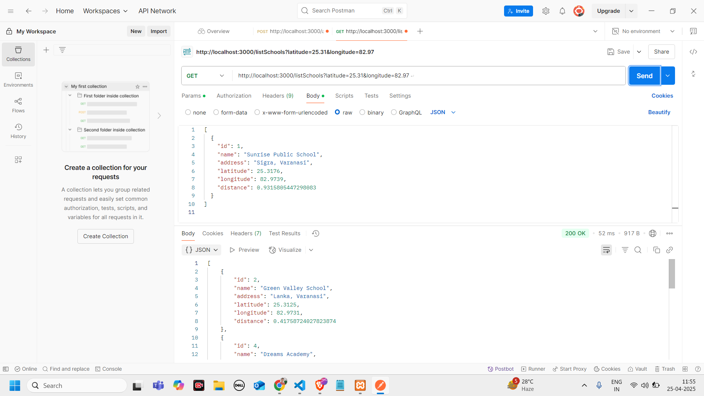
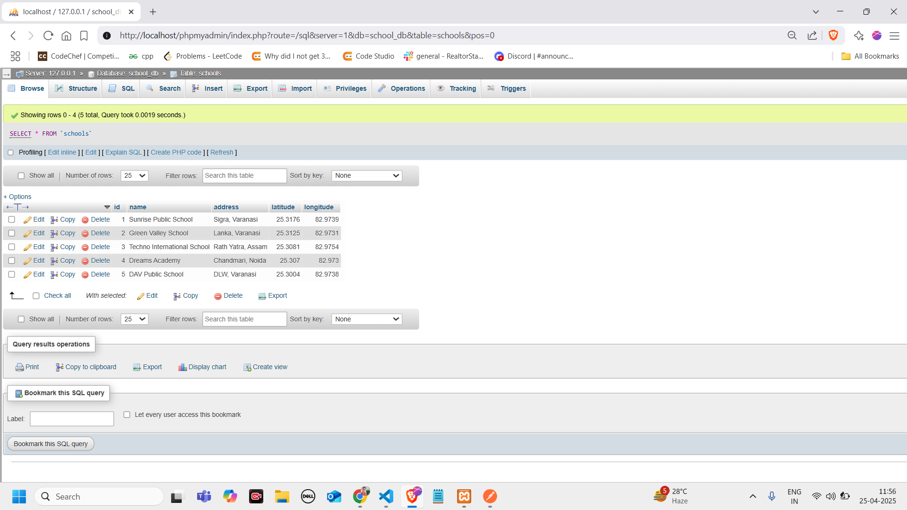

## This project implements a School Management System using Node.js, Express.js, and MySQL. It provides APIs to add and retrieve schools based on proximity to a user’s location.

🛠️ Tech Stack
Backend: Node.js, Express.js

#Database: MySQL

Tools: Postman for testing, XAMPP for local MySQL database

🚀 Features
Add School: Adds a new school with its name, address, latitude, and longitude to the database.

List Schools: Retrieves all schools sorted by their proximity to the provided latitude and longitude.
## 📷 API Test Example in Postman

## 🗄️ MySQL Table View

Here’s a preview of the data added in the MySQL database:

⚙️ Setup Instructions
1. Clone the repository:

git clone https://github.com/Ashish20cs17/School_api.git
2. Install dependencies:
Navigate to the project folder and run:

npm install
3. Setup the database:
Ensure XAMPP is running with MySQL.

Create a new database called school_db in phpMyAdmin.

Import the school_db.sql file from the db/ folder into the database.

4. Configure the .env file:
Create a .env file in the root directory.

Set up your database connection credentials:

DB_HOST=localhost
DB_USER=root
DB_PASSWORD=your_mysql_password
DB_NAME=school_db
PORT=3000
Replace your_mysql_password with your MySQL root password.

🏃‍♂️ Running the Application
Start the Node.js server:
node app.js
The server will run on http://localhost:3000.

📬 API Endpoints
1. Add a School
Endpoint: /addSchool

Method: POST

Body:

json
Copy
Edit
{
  "name": "School Name",
  "address": "School Address",
  "latitude": 12.9716,
  "longitude": 77.5946
}
Response:

json
Copy
Edit
{
  "message": "School added successfully",
  "id": 1
}
2. List Schools by Proximity
Endpoint: /listSchools

Method: GET

Query Params:

latitude (User's latitude)

longitude (User's longitude)

Example: /listSchools?latitude=25.3176&longitude=82.9739

Response:

[
  {
    "id": 1,
    "name": "Sunrise Public School",
    "address": "Sigra, Varanasi",
    "latitude": 25.3176,
    "longitude": 82.9739,
    "distance": 0.9315805447298083
  }
]
📝 Postman Collection
You can test the API using the Postman collection (shareable link to be provided).

🧑‍💻 Contributing
Feel free to fork the repository and create pull requests. For any issues or suggestions, please open an issue.

🔒 License
This project is licensed under the MIT License.
